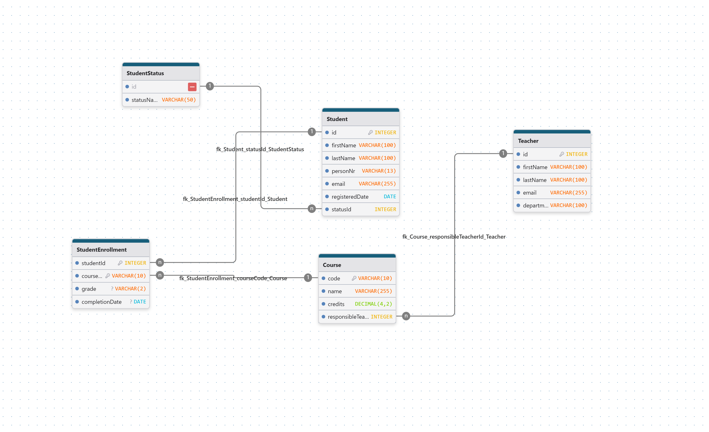

Databas: NexusDB
# Teoretisk Rapport / Student- och Kursadministrationssystem:

## 🎯 1. Domän och Syfte

 #### Domän: 
 Jag har valt att skapa en databas för hantering av studenter, lärare, kurser och kursregistreringar inom en universitetsmiljö (Kursportal).

 #### Syfte: 
 Att skapa en databasmodell som är effektiv, skalbar och upprätthåller hög dataintegritet. Systemet ska kunna hantera de centrala enheterna (Student, Teacher, Course) och den komplexa Many-to-Many-relationen mellan studenter och kurser.

#### Användarroller:
 Databasen är designad för att hantera information som rör de två centrala användarrollerna i domänen:
**Student:** En individ som registreras i systemet och kan skrivas in på kurser.
**Lärare:** En individ som är anställd och har ansvar för en eller flera kurser.

En administratörsroll (med rättigheter att skapa/radera användare och kurser) är inte en del av själva databasmodellen, utan förväntas hanteras av applikationslogiken ,t.ex. ett API, som ansluter till databasen.

## 🗃️ 2. Databasöversikt och Modell

### 🔑 2.1 Tabellstruktur och Nycklar 
(Baserat på ER-Diagrammet)

| Tabellnamn | Kolumn | Datatyp | Nyckeltyp | FK Pekar till |
| :--- | :--- | :--- | :--- | :--- |
| **Teacher** | `id` | INTEGER | **PK** | N/A |
| | `firstName` | VARCHAR(100) | - | N/A |
| | `lastName` | VARCHAR(100) | - | N/A |
| | `email` | VARCHAR(255) | - | N/A |
| | `department` | VARCHAR(100) | - | N/A |
| **Course** | `code` | VARCHAR(10) | **PK** | N/A |
| | `name` | VARCHAR(255) | - | N/A |
| | `credits` | DECIMAL(4, 2) | - | N/A |
| | `responsibleTeacherId` | INTEGER | **FK** | `Teacher(id)` |
| **Student** | `id` | INTEGER | **PK** | N/A |
| | `firstName` | VARCHAR(100) | - | N/A |
| | `lastName` | VARCHAR(100) | - | N/A |
| | `personNr` | VARCHAR(13) | UNIQUE | N/A |
| | `email` | VARCHAR(255) | UNIQUE | N/A |
| | `registeredDate` | DATE | - | N/A |
| | `statusId` | INTEGER | **FK** | `StudentStatus(id)` |
| **StudentStatus** | `id` | INTEGER | **PK** | N/A |
| | `statusName` | VARCHAR(50) | - | N/A |
| **StudentEnrollment** | **`studentId`** | INTEGER | **PK, FK** | `Student(id)` |
| | **`courseCode`** | VARCHAR(10) | **PK, FK** | `Course(code)` |
| | `grade` | VARCHAR(2) | - | N/A |
| | `completionDate` | DATE | - | N/A |

**(Notera:** Tabellen StudentEnrollment använder en Sammansatt Primärnyckel (PK), vilken består av studentId och courseCode. Båda dessa fält fungerar även som Främmande Nycklar (FK) till respektive entitet.)

## 🔗 3. Relationer och Motivering

### → 3.1 One-to-Many (1-M) Relation

**Relation:** Teacher (1) till Course (M). En lärare kan ansvara för flera kurser, men varje kurs har endast en ansvarig lärare.

**Implementering:** Detta realiseras genom den främmande nyckeln responsibleTeacherId i tabellen Course, som pekar på primärnyckeln i Teacher.

**Motivering:** Denna separering minskar dataredundans. Istället för att duplicera lärarens information (namn, e-post, avdelning) för varje kurs de ansvarar för, lagras endast en liten integer-nyckel.

### ↔️ 3.2 Many-to-Many (M-M) Relation

**Relation:** Student (M) till Course (M). En student kan läsa flera kurser, och varje kurs har flera studenter.

**Implementering:** Denna relation löses upp med hjälp av kopplingstabellen StudentEnrollment.

**Motivering:** Kopplingstabellen är absolut nödvändig. Den hanterar inte bara själva kopplingen, utan lagrar också data som är beroende av båda entiteterna, nämligen grade och completionDate. Den sammansatta primärnyckeln (studentId, courseCode) garanterar att varje registrering är unik.

## ⚖️ 4. Normalisering

Databasmodellen har designats för att uppfylla minst Tredje Normalformen (3NF). Jag har valt att stanna vid 3NF då det ger den bästa balansen mellan dataintegritet och frågeprestanda.

För att ge lite exempel på de olika normalformerna som databasen uppfyller:

- 1NF (Första Normalformen): Uppfylls genom att alla kolumner är atomiska. 
Exempelvis lagras inte en lista med kurser i en kolumn i Student-tabellen.

- 2NF (Andra Normalformen): Uppfylls i vår kopplingstabell StudentEnrollment. De icke-nyckelattributen (grade och completionDate) är beroende av hela den sammansatta primärnyckeln (studentId, courseCode).

- 3NF (Tredje Normalformen): Uppfylls genom att inga transitiva beroenden finns.

I Student-tabellen beror t.ex. firstName och email direkt på PK:n (id), och inte på ett annat icke-nyckelattribut som t.ex. personNr.

Alla lärarens detaljer är flyttade till Teacher-tabellen, vilket eliminerar transitiva beroenden i Course-tabellen.

Slutsats: Genom att separera data i fyra dedikerade tabeller eliminerar vi redundans och säkerställer dataintegritet, vilket är målet med 3NF. Inga medvetna avsteg från normaliseringen har gjorts.

## 🗂️ 5. Val av Datatyper

Valet av datatyper är avgörande för att optimera lagring, prestanda och dataintegritet. Istället för att lagra all text som VARCHAR(255) eller alla siffror som INT, har datatyperna anpassats efter sitt specifika syfte.

Här är motiveringen för de mest centrala valen:

#### INT (Heltal)

Exempel: Används för id-kolumner (t.ex. Student.id, Teacher.id) i kombination med AUTO_INCREMENT.

Varför: Detta skapar en snabb, stabil och unik surrogatnyckel (ett löparnummer). Heltal är det mest effektiva sättet för databasen att göra sökningar och JOIN-operationer.

#### VARCHAR (Textsträngar)

Varför: Används för all textdata. **VARCHAR** (variabel längd) är mer lagringseffektivt än **CHAR** (fast längd) eftersom den bara tar upp plats för de tecken som faktiskt matas in. Detta gör att databasen inte behöver reservera (binda) onödigt mycket minne för korta texter.

För extremt stora textmängder (som t.ex. uppsatser eller långa kommentarer) hade datatypen **TEXT** kunnat användas, men för denna domän är **VARCHAR** mer än tillräckligt och generellt mer performant för de angivna längderna.
Exempel: Längden anpassas efter behov: VARCHAR(100) för namn, VARCHAR(2) för korta betygskoder (grade), och VARCHAR(255) för längre fält som e-post.

Specialfall: personNr (VARCHAR(13)) lagras som text. Detta är ett kritiskt val för att kunna inkludera bindestrecket (-) och förhindra att eventuella inledande nollor tas bort, vilket hade hänt om det lagrats som en siffra.

#### DECIMAL (Exakta tal)

Exempel: Används för credits (kurspoäng) som DECIMAL(4, 2).

Varför: Till skillnad från **FLOAT** (flyttal), garanterar **DECIMAL** exakt precision. Det är nödvändigt för att värden som 7.50 ska lagras exakt så, och inte som 7.4999.... Det är standard för alla värden där exakthet är viktig, som poäng eller valuta.

#### DATE (Datum)

Exempel: Används för registeredDate.

Varför: Denna datatyp är optimerad för att enbart lagra datum (år, månad, dag) utan någon tidskomponent (timmar, minuter). Det sparar utrymme och är logiskt korrekt för ett registreringsdatum.

## 🛡️ 6. Dataintegritet och Säkerhetsaspekter

Dataintegritet har säkerställts på databasnivå genom att tillämpa strikta begränsningar. Detta är den första och viktigaste försvarslinjen mot felaktig eller ofullständig data.

### 🚫 6.1 Unikhetsbegränsningar (UNIQUE)

**Student.personNr:** Garanterar att ingen student kan registreras med ett dubblerat personnummer.

**Student.email:** Garanterar att varje student har en unik kontaktadress.

**Teacher.email:** Garanterar att varje lärare har en unik kontaktadress.

### ❗ 6.2 Inte-Null Begränsningar (NOT NULL)

Alla kärnattribut som är väsentliga för en entitet, såsom namn, personnummer, kurskod och poäng, har begränsningen NOT NULL. Detta säkerställer att ingen student eller kurs kan skapas utan fullständig grundinformation.

Exempel: Student.firstName, Course.name, Teacher.department måste alltid ha ett värde.

### ⛓️ 6.3 Främmande Nycklar (Foreign Keys – FK)

De främmande nycklarna (**responsibleTeacherId, studentId, courseCode**) säkerställer att alla relationer i databasen förblir valida. 

Genom att tvinga fram en koppling till existerande rader i huvudtabellerna (**Teacher, Student, Course**) förhindras uppkomsten av **"hängande referenser" (orphaned records)**. 

Detta uppfyller det fundamentala kravet på referensintegritet genom att omöjliggöra kopplingar till data som inte finns.

#### 6.3.1 ⛓️ Hantering av Relationer vid Radering (ON DELETE)

För att upprätthålla referensintegritet (säkerställa att inga "hängande referenser" skapas) har jag använt mig medvetet av två olika strategier för ON DELETE i databasen:

####  ON DELETE RESTRICT (Standardregeln) - Skydda Kärndata

I de flesta relationer har jag använt standardbeteendet, som är ON DELETE RESTRICT (eller NO ACTION). Detta fungerar som ett viktigt skyddsnät.

Relation: Teacher (1) -> Course (M)

Relation: StudentStatus (1) -> Student (M)

Motivering (Exempel): Om en användare försöker radera en lärare (t.ex. Anna Andersson) som fortfarande är listad som kursansvarig (responsibleTeacherId) för tre kurser, kommer databasen att blockera raderingen.

Detta är avsiktligt. Det tvingar applikationen (eller administratören) att först vidta en åtgärd – antingen måste kurserna raderas eller, mer troligt, förflyttas till en ny lärare – innan den ursprungliga läraren kan tas bort. Samma logik gäller för StudentStatus: databasen förhindrar att statusen "Aktiv" raderas om det är studenter som har den status fortfande kopplat till sig.

Detta skyddar systemet från att hamna i ett korrupt tillstånd där kurser saknar ansvariga lärare.

####  ON DELETE CASCADE - Automatisk Uppstädning
I ett specifikt fall har jag valt att använda mig av metoden ON DELETE CASCADE för att automatisera uppstädning av beroende data.

Relation: Student (1) -> StudentEnrollment (M)

Relation: Course (1) -> StudentEnrollment (M)

Motivering (Exempel): Kopplingstabellen StudentEnrollment innehåller data (som betyg) som är helt meningslös utan sin "förälder".

Om en Student raderas: Om student "Sara Svensson" (ID 1) tas bort från systemet, är hennes gamla kursregistreringar (t.ex. hennes betyg i 'DB101') inte längre relevanta. Tack vare ON DELETE CASCADE kommer databasen automatiskt att städa bort alla rader i StudentEnrollment som tillhörde "Sara Svensson".

Om en Kurs raderas: Om kursen 'DB101' raderas (kanske att den läggs ner), är alla registreringar för den kursen också irrelevanta. ON DELETE CASCADE raderar dem automatiskt.

## ⚡ 7. Indexering

### 7.1. Student.email (Sökoptimering): 

E-postadressen är, tillsammans med personnumret, en av de primära metoderna för att söka efter en specifik student. 

Utan ett index skulle databasen behöva göra en **"table scan"** vid varje sökning. Det innebär att databasen måste läsa igenom tabellens samtliga rader sekventiellt för att hitta en matchning. I takt med att antalet studenter växer skulle detta leda till en linjär försämring av prestandan. 

Genom att indexera kolumnen kan databasen istället göra en direktuppslagning, vilket bibehåller snabba svarstider oavsett datamängd.

### 7.2. Student.statusId (Join-optimering): 
Eftersom statusId är en främmande nyckel som används frekvent för att koppla ihop Student och StudentStatus **(i JOIN-frågor)**, snabbar detta index upp hämtningen av studentlistor där vi vill visa statusnamnet (t.ex. "Aktiv") istället för bara siffran.

## 📊 8. Avancerad Dataanalys och Aggregering
För att kunna dra slutsatser ur datan räcker det inte alltid med enkla SELECT-frågor. Jag har använt mer avancerade SQL-koncept för att skapa meningsfulla rapporter.

### 8.1 Filtrering av Grupper (HAVING vs WHERE)
I rapporten som identifierar studenter med mer än 30 högskolepoäng (fråga 11) används klausulen **HAVING** istället för **WHERE**.

Motivering: Detta val baseras på SQL-motorns exekveringsordning.

**WHERE** filtrerar rader innan någon gruppering eller uträkning sker. Det är omöjligt att använda **WHERE** för att filtrera på en summa (**SUM**), eftersom summan inte existerar ännu.

**GROUP BY** samlar raderna per student.

**HAVING** appliceras efter att datan har grupperats och summerats.

Därför är HAVING totalCredits > 30 det enda korrekta sättet att filtrera bort studenter baserat på deras totala poängsumma.

### 8.2 Datatransformation (CASE)
I rapporten för kursstorlekar (fråga 12) används en CASE-sats.

Motivering: Syftet är att omvandla kvantitativ data (exakta poäng, t.ex. 7.5 eller 15.0) till kvalitativ data (kategorier som "Liten", "Mellan", "Stor") direkt i databaslagret. Genom att flytta denna logik till SQL-frågan avlastas applikationen/frontend från att behöva göra dessa beräkningar. Det standardiserar också begreppen; definitionen av vad som är en "Stor Kurs" blir densamma oavsett vem som hämtar datan.

## 👁️ 9. Vyer (Views) och Abstraktion
Jag har implementerat tre specifika vyer för att skapa ett abstraktionslager mellan den komplexa tabellstrukturen och slutanvändaren.

### 9.1 Abstraktion av Komplexitet (v_FullEnrollmentDetails)
Syfte: Förenkling för administratörer. Denna vy döljer komplexiteten av att behöva sammanfoga (JOIN) fyra olika tabeller (Student, StudentStatus, Course, StudentEnrollment). Istället för att skriva en lång SQL-fråga varje gång man vill se en students betyg och status, kan användaren enkelt köra SELECT * FROM v_FullEnrollmentDetails.

### 9.2 Administrativt Stöd (v_CourseStudents)
Syfte: Kontaktlistor och operativt arbete. Denna vy är skräddarsydd för att generera klasslistor. Den fokuserar på kontaktuppgifter (e-post, personnummer) kopplat till kurskoder. Genom att spara detta som en vy säkerställer jag att alla lärare använder samma underlag när de ska kontakta sina studenter.

### 9.3 Analytisk Statistik (v_TopCourses)
Syfte: Beslutsunderlag. Denna vy skiljer sig från de andra genom att den visar aggregerad data (statistik) istället för individdata. Den räknar automatiskt antalet studenter per kurs (COUNT). Detta ger ledningen en direkt överblick över kursbeläggningen utan att de behöver förstå hur man skriver GROUP BY-frågor.

## ⚙️ 10. Stored Procedures (Lagrade Procedurer)

Istället för att applikationen skickar råa INSERT eller UPDATE-frågor direkt mot tabellerna, har jag kapslat in affärslogiken i procedurer (RegisterStudentToCourse och GraduateStudentToCourse). Detta fungerar som ett skyddande API-lager direkt i databasen.

### 10.1 Generell Motivering: Säkerhet och Underhåll
Genom att styra datamanipulation via procedurer uppnår vi två saker:

**Abstraktion:** Om tabellstrukturen ändras i framtiden (t.ex. namnbyte på en kolumn), behöver vi bara uppdatera koden inuti proceduren. Alla externa applikationer som kallar på proceduren kan fortsätta fungera utan ändringar.

**Åtkomstkontroll:** Vi kan begränsa användarens rättigheter så att de bara får köra procedurer, men inte har rättighet att köra godtyckliga DELETE eller UPDATE-frågor direkt mot tabellerna.

### 10.2 Specifik Motivering: GraduateStudentToCourse (Uppdatering)
Proceduren för att betygsätta en student (GraduateStudentToCourse) löser två specifika problem kring dataintegritet:

**Datakonsistens (Atomär handling):** I verksamheten hänger ett betyg (grade) ihop med ett examensdatum (completionDate). Om applikationen skulle hantera detta separat finns risken för "trasig data" (t.ex. att en student får ett betyg men saknar datum). Denna procedur tvingar systemet att ange både betyg och datum samtidigt, vilket garanterar att en avslutad kurs alltid är komplett.

**Säkerhet vid UPDATE:** Att tillåta råa UPDATE-frågor från en applikation är riskfyllt. Om en utvecklare missar en WHERE-sats i koden kan hela tabellen skrivas över av misstag. Genom att använda en procedur låser vi logiken så att uppdateringen alltid begränsas till exakt en student och en kurskod. Databasen agerar "grindvakt" och förhindrar massuppdateringar av misstag.